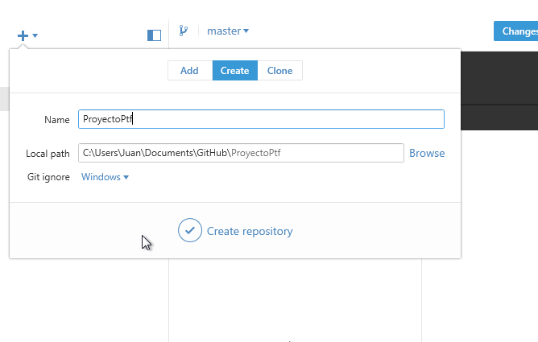

# Comandos Básicos - Crear o Clonar un repositorio

## Creando un repositorio desde cero
---
Para poder manejar un repositorio lo primero que debemos hacer es crear una carpeta para nuestro proyecto.
Una vez que tengamos esta carpeta creada debemos ingresar a ella por medio de la linea de comandos.
Supongamos que creeamos la carpeta en "Documentos"

```bash
~$ cd Documentos
~/Documentos$ mkdir ProyectoPtf
~/Documentos$ cd ProyectoPtf
```

Una vez que estemos dentro de esta carpeta debemos ejecutar el sitguiente comandos

```bash
~/Documentos$ git init
```

Este comando creara una nueva carpeta llamada **.git** que contiene los archivos necesarios para hacer el seguimiento de cambios en archivos.



#### Crear repositorio desde GitHub Desktop
Para crear un repositorio desde la interfaz gráfica que nos ofrece GitHub (solo Windows y Mac) tenemos que hacer click en el **+** y completar el espacio en blanco con el nombre de nuestro proyecto.

## Clonando un repositorio existente
---
Si queres tenes una copia de un repositorio existente, como puede ser el de un proyecto al que quieras contribuir, el comando que tenemos que usar es **git clone [url]**
Por ejemplo si quisieras clonar el repositorio donde esta este tutorial podrias hacer:

```bash
~/Documentos$ git clone https://github.com/juancuiule/intro-a-git.git
```

Este comando se encarga de crear una carpeta con el nombre del proyecto (**intro-a-git**) y de clonar ahí todos los archivos.


---

<br>
<style>
.my-btn {
    width: 120px;
    display: inline;
    text-align: center;
    color: rgba(255, 255, 255, 0.6);
    background-color: #159957;
    background-image: linear-gradient(120deg, #155799, #159957);
    transition: color 0.2s ease-in-out;
}

.my-btn:hover {
    color: #FFFFFF;
}

.btn-next {
    margin-left: 71.9% !important;
}
</style>
<a href="index" class="btn my-btn">Anterior</a>
<a href="agregar-archivos" class="btn my-btn btn-next">Siguiente</a>
