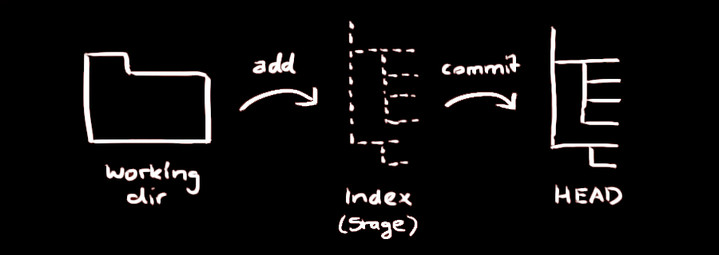

# Git Status, Add y Commit

Antes de empezar a guardar los cambios o agregar archivos tenemos que entender cómo maneja git el estado de los archivos y sus cambios.
El repositorio local (lo que está en nuestra PC) está compuesto por tres árboles que son mantenidos por git.
El primero es la carpeta del proyecto que contiene los archivos.
El segundo es el **Index** o zona de "stage".
Por último **HEAD** quien apunta al último __commit__ que hayas hecho.



## Git Status
Una vez que ya tenemos un repositorio es importante saber en que estado se encuentran los archivos que tenemos en nuestro proyecto, cuales de ellos estan modificados, cuales se crearon o cuales se eliminaron.
Para esto usamos el comando **git status**

```bash
~/Documentos/ProyectoPtf/$ git status
On branch master
Your branch is up-to-date with 'origin/master'.
Changes not staged for commit:
  (use "git add <file>..." to update what will be committed)
  (use "git checkout -- <file>..." to discard changes in working directory)

	modified:   docs/comandos-basicos/agregar-archivos.md
	modified:   docs/comandos-basicos/crear-o-clonar-un-repositorio.md
	modified:   docs/media/crear-repositorio.png

Untracked files:
  (use "git add <file>..." to include in what will be committed)

	docs/media/arboles.png

no changes added to commit (use "git add" and/or "git commit -a")
```

Como podemos ver, la consola nos devuelve un resumen del estado del repositorio, dieciendonos en que rama estamos, cuales son los archivos que tienen cambios, y cuales son los archivos que no están siendo considerados para el próximo __commit__

## Add y Commit
Necesitamos usar distintos comandos para poder mover nuestros archivos de un sector o árbol a otro.
Cuando hacemos una modificación en algún archivo generemos una diferencia entre lo que se encuentra en nuestra carpeta y la última versión de este archivo en **HEAD**

#### Git Add
Para pasar estos cambios a **Index** usamos el comando **git add**.
Si queremos agregrar todos los cambios que hicimos a **Index** escribimos:

```bash
~/Documentos/ProyectoPtf/$ git add .
```

Podemos verificar que esto haya sucedido haciendo:
```bash
~/Documentos/ProyectoPtf/$ git status
On branch master
Your branch is up-to-date with 'origin/master'.
Changes to be committed:
  (use "git reset HEAD <file>..." to unstage)

	modified:   docs/comandos-basicos/agregar-archivos.md
	modified:   docs/comandos-basicos/crear-o-clonar-un-repositorio.md
	new file:   docs/media/arboles.png
	modified:   docs/media/crear-repositorio.png
```

En el caso de que queramos indexar los cambios generados en un solo archivo reemplazamos el "." por el nombre o la ruta al archivo
```bash
~/Documentos/ProyectoPtf/$ git add <nombre-del-archivo>
```

#### Git Commit

Si bien ya pasamos estos cambios a la zona de stage o index, no se encuentran versionados con lo cual tenemos que usar un comando mas para empaquetarlos con un mensaje que describa a estos cambios.
El comando que vamos a usar es **git commit**

```bash
~/Documentos/ProyectoPtf/$ git commit -m "Mensaje que describe los camios"
[master 39d3f5d] Mensaje que describe los cambios
 1 file changed, 110 insertions(+)
 create mode 100644 docs/haciendo-cambios.md
```

Después de hacer este commit podemos volver a chequear el estado del repo con **git status**

```bash
~/Documentos/ProyectoPtf/$ git status
On branch master
Your branch is ahead of 'origin/master' by 1 commit.
  (use "git push" to publish your local commits)
nothing to commit, working directory clean
```

En este caso **status** nos dice que estamos un commit por delante de lo que se encuentra en nuestro repositorio __remoto__, tema que vamos a ver a continuación.

---

<br>
<style>
.my-btn {
    height: 50px;
    width: 120px;
    display: inline;
    text-align: center;
    color: rgba(255, 255, 255, 0.6);
    background-color: #159957;
    background-image: linear-gradient(120deg, #155799, #159957);
    transition: color 0.2s ease-in-out;
    border-radius: 0.3rem;
    padding: 12px;
}

.my-btn:hover {
    color: #FFFFFF;
}

.Grid {
    display:flex;
    justify-content: space-around;
}
</style>
<div class="Grid">
    <a href="crear-o-clonar-un-repositorio" class="btn my-btn">Anterior</a>
    <a href="repositorio-remoto" class="btn my-btn btn-next">Siguiente</a>
</div>
