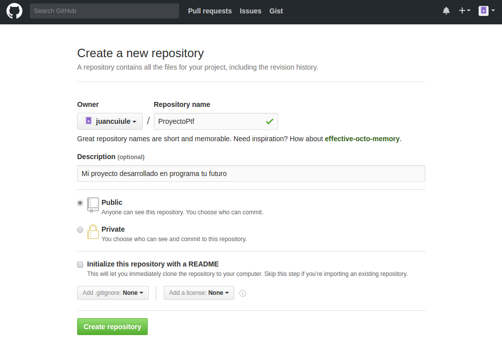

# Git - Repositorios Remotos

Hasta ahora todo lo que hicimos queda solo en nuestra maquina, pero como dijimos anteriormente git es muy util para compartir código con otros. Por eso vamos a ver cómo podemos subit nuestro código a un repositorio "remoto". Hay varias páginas que nos permiten subir nuestros repos, nosotros vamos a usar GitHub.

Para comenzar vamos a crearnos una cuenta de usuario en [GitHub](https://github.com) llenando el formulario de registro.

Una vez que ya tengamos la cuenta hecha hacemos click sobre la pestaña "New Repository"

Esto nos lleva a la siguiente página donde vamos a crear nuestro repositorio remoto

---

 

<a href="haciendo-cambios" class="btn my-btn">Anterior</a>
<a href="branches" class="btn my-btn btn-next">Siguiente</a>
