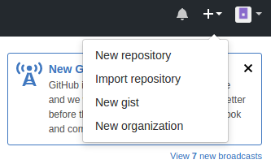
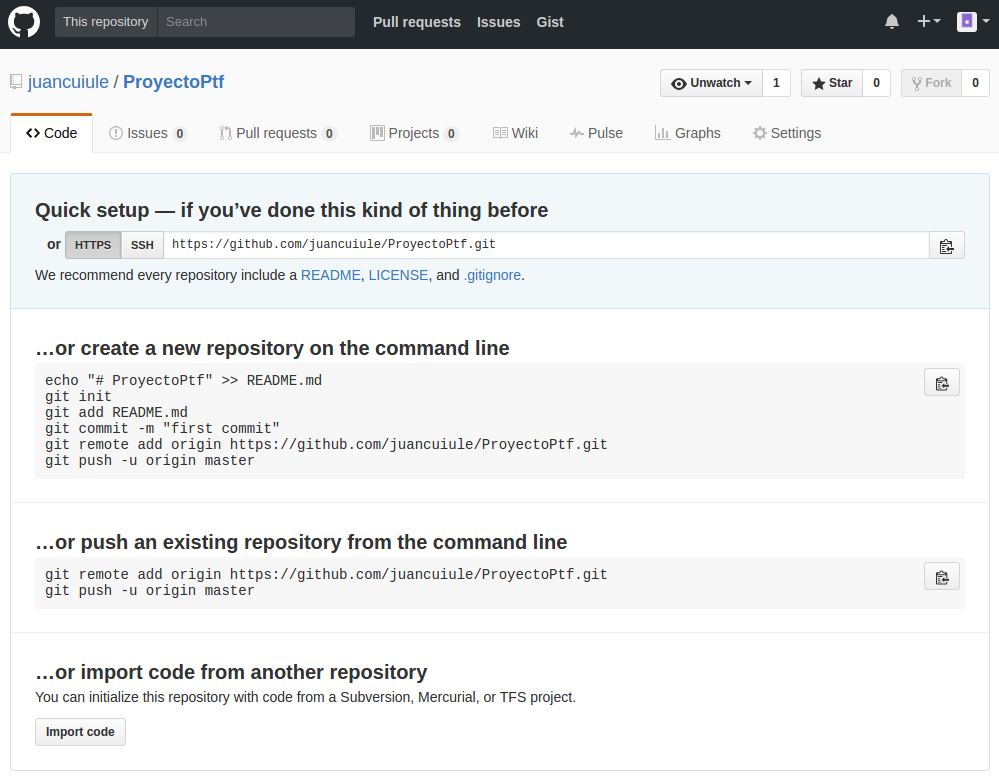
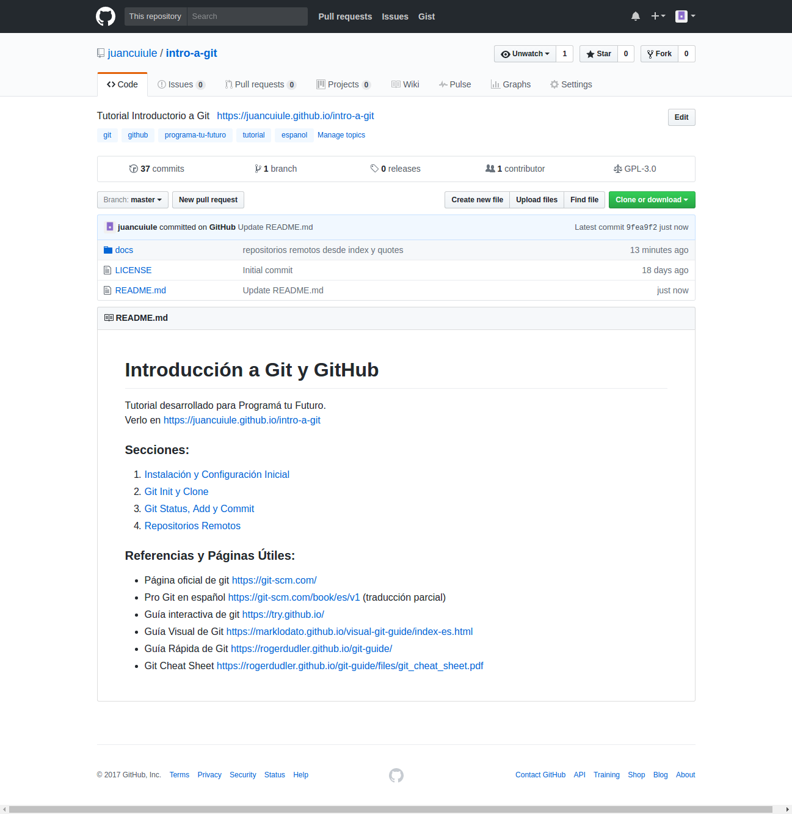

# Git - Repositorios Remotos

Hasta ahora todo lo que hicimos queda solo en nuestra maquina, pero como dijimos anteriormente git es muy útil para compartir código con otros. Por eso vamos a ver cómo podemos subir nuestro código a un repositorio "remoto". Hay varias páginas que nos permiten subir nuestros proyectos, nosotros vamos a usar GitHub.

> Para comenzar vamos a crearnos una cuenta de usuario en [GitHub](https://github.com) llenando el formulario de registro.


> Una vez que ya tengamos la cuenta hecha hacemos click sobre la pestaña "New Repository"



> Esto nos lleva a la siguiente página donde vamos a crear nuestro repositorio remoto


> Cuando ya creamos el repositorio remoto vamos a subir nuestro código a este repo.



Como vemos en la imagen de arriba algunas lineas que debemos poner en la consola de comandos para conectar nuestro repositorio local con el remoto.

Si ya tenemos nuestro repositorio creado localmente e hicimos algunos commits vamos a hacer lo siguiente para poder subir el código:

```bash
~/Documentos/ProyectoPtf/$ git remote add origin https://github.com/juancuiule/ProyectoPtf.git
~/Documentos/ProyectoPtf/$ git push -u origin master
```

Si todavía no iniciamos nuestro repositorio localmente hagamos esto:

```bash
~/Documentos/ProyectoPtf/$ echo "# ProyectoPtf" >> README.md
~/Documentos/ProyectoPtf/$ git init
~/Documentos/ProyectoPtf/$ git add README.md
~/Documentos/ProyectoPtf/$ git commit -m "first commit"
~/Documentos/ProyectoPtf/$ git remote add origin https://github.com/juancuiule/ProyectoPtf.git
~/Documentos/ProyectoPtf/$ git push -u origin master
```

> Una vez que ya "pusheamos" nuestros commits al repositorio remoto la página en github debería ser similar a la siguiente...



---

<br>
<style>
.my-btn {
    width: 120px;
    display: inline;
    text-align: center;
    color: rgba(255, 255, 255, 0.6);
    background-color: #159957;
    background-image: linear-gradient(120deg, #155799, #159957);
    transition: color 0.2s ease-in-out;
}

.my-btn:hover {
    color: #FFFFFF;
}

.btn-next {
    margin-left: 71.9% !important;
}
</style>
<a href="haciendo-cambios" class="btn my-btn">Anterior</a>
<a href="repositorio-remoto-2" class="btn my-btn btn-next">Siguiente</a>
